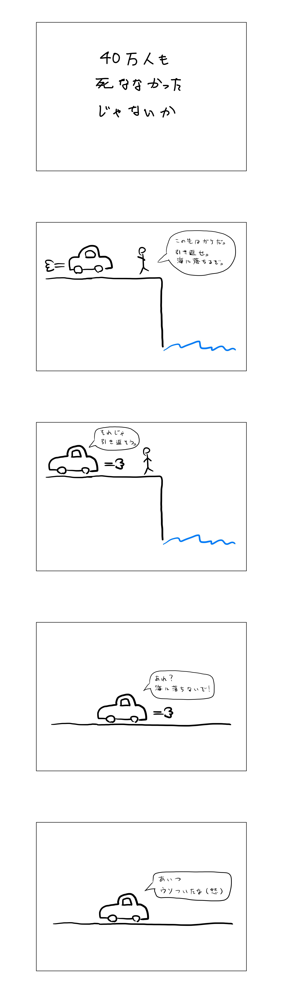

2021 (Japanese)
===============

2021-11-16
----------

給付金について
^^^^^^^^^^^^^^^^^^^^^^

* `歓迎、助かる、食費に　困窮家庭、医療優先を　給付金一律１０万円、千葉県民の声 <https://www.chibanippo.co.jp/news/national/684617>`_ (2020/04/19)

  * 給付で助かっている人もいれば、困っていないという人もいる。

* `持続化給付金もらえて助かった 農機具直せた資材代払えた喜びの声続々 <http://www.nouminren.ne.jp/newspaper.php?fname=dat/202012/2020121401.htm>`_ (2020/12/14)

  * 持続化給付金で助かっている農家の人々の声。

* `給付金を課税対象にすれば、届けたい人に多めに、届ける必要がない人には少なめに届く <https://news.yahoo.co.jp/byline/takahashinaruhisa/20211013-00262975>`_ (2021/10/13)

  * 給付に条件をつけるのではなく、給付金に課税することを提案している。

デマ・フェイクニュース・世論操縦など
^^^^^^^^^^^^^^^^^^^^^^^^^^^^^^^^^^^^^^^^^^^^^^^^^^^^^^^

日本では牛のコスプレして国会を襲撃するような人は出てこないと思うけど、かつて自衛隊の前で割腹自殺してしまった人とかいたらしいし、地下鉄でサリン撒いちゃった人たちもいたのでどうなるか分からない。そう言えば、昔、 `社会党委員長が刺殺される事件 <https://natgeo.nikkeibp.co.jp/nng/article/20120118/296593/>`_ もあった。近頃電車内で物騒な事件も起きているし、扇動された人たちがテロを起こさないといいなと思う。

* `ツイッター社、トランプ氏の個人アカウントを永久凍結　各社がSNSパーラーを凍結や削除 <https://www.bbc.com/japanese/55583622>`_ (2021/01/09)

* `米連邦地裁、議会襲撃当時の文書の開示認める　トランプ氏の訴え退け <https://www.bbc.com/japanese/59229959>`_ (2021/11/10)

* `オーストリア首相が辞任　汚職容疑で捜査、首相は疑惑関与否定 <https://www.bbc.com/japanese/58860040>`_ (2021/10/10)

  * 公金を使って大衆紙に自分に有利な記事を書かせようとしたとの疑惑が立ち上がり辞任したとのこと。

* `オーストリア首相 公金不正支出疑惑で辞任も側近の外相が就任 <https://www3.nhk.or.jp/news/html/20211012/k10013303021000.html>`_ (2021/10/12) 

* `岸田首相はDappi疑惑を放置して衆院選を戦うのか <https://www.newsweekjapan.jp/fujisaki/2021/10/dappi.php>`_ (2021/10/16)

* `昨年の米大統領選でもプーチン氏が「親トランプ」工作承認＝米政府報告 <https://www.bbc.com/japanese/56412768>`_ (2021/03/17)

* `ロシアが昨年の大統領選に介入、バイデン氏を「中傷」　米諜報機関報告書 <https://www.cnn.co.jp/usa/35167991.html>`_ (2021/03/18)

* `〔研究レポート〕ディスインフォメーションと民主主義：中国の影響力工作が日本に与える影響 <https://www.jiia.or.jp/column/post-63.html>`_ (2021/03/16)

* `文氏側近の知事、実刑確定　不正な世論操作で懲役２年―韓国 <https://www.jiji.com/jc/article?k=2021072100689&g=int>`_ (2021/07/21)

* `自民党「影の幹事長」がDappiへの関与を否定。群馬の村で見えた“親族のつながり”とは <https://www.buzzfeed.com/jp/kotahatachi/dappi-5>`_ (2021/11/15)

2021-10-25
----------

消費税について思うこと
^^^^^^^^^^^^^^^^^^^^^^^^^^^^^^^^^^^^^^^^^^^^^^^

:ref:`以前 <zaisei_no_shikumi>` にも触れた `財政のしくみがわかる本　神野直彦（著） <https://www.amazon.co.jp/財政のしくみがわかる本-岩波ジュニア新書-神野-直彦/dp/4005005667/>`_ によると、
民主主義における予算は一つでなければならないという原則があり、これはノン・アフェクタシオンの原則（非充当関係）の原則と呼ばれるらしい。これは、特定の支出と特定の収入を結びつけてはならないということ。ただ、実際にはいくつか例外もある。

「消費税増税分は全額社会保障に使う」ということがよく言われるが、それはこのこの非充当関係の原則に反しているように思える。消費税と社会保障費を結びつける法的根拠もよく分からない。結局のところ、消費税と直接税を合わせた税収全体が増えなければ社会保障費も不足するのではないか。

2021-09-08
----------

日本の研究の現状
^^^^^^^^^^^^^^^^^^^^^^^^^^^^^^^^^

日本の研究が今、大変なことになっているらしい。 `所さんに報告せねば <https://www.nhk.jp/p/taihentokoro/ts/5RG1V58XZQ/>`_

* `光触媒「発見者」藤嶋昭氏と研究チーム、中国・上海理工大に移籍 <https://mainichi.jp/articles/20210902/k00/00m/040/261000c>`_ (2021/09/02)

  * こちらの `記事 <https://news.yahoo.co.jp/byline/enokieisuke/20210904-00256489>`_ でも言及されている。

* `日本の研究力、低落の一途　注目論文数10位に <https://www.nikkei.com/article/DGXZQOUC209AC0Q1A820C2000000/>`_ (2021/08/29)

  * 「低迷のきっかけに04年の国立大学の法人化を挙げる声は大学関係者の中で多い。」とのこと。

* `【シュンペーター賞受賞記念】量子コンピューター研究者を「年収500万」で雇う日本は「野生化」できるか 早稲田大学商学学術院教授・清水洋氏インタビュー <https://www.fsight.jp/articles/-/48177>`_ (2021/08/16)

  * なんだかよく分からないが、アメリカの真似すればいいと言うものでもないと言うことらしい。

* `科学技術の研究開発費、米中との差がさらに広がる　博士号人材の登用進まず <https://www.itmedia.co.jp/news/articles/2108/12/news107.html>`_ (2021/08/12)

  * 研究費の対 GDP 比はどうなっているのだろう。

* `ここがネック、国の「基礎研究支援」の成果が出にくくなった理由 成果への焦りが研究者から斬新な発想を奪っている <https://jbpress.ismedia.jp/articles/-/65571>`_ (2021/06/08)

  * 画期的な研究成果を増やすには、競争的資金よりも交付金を増やす方がいいとのこと。

2021-09-03
----------

抗原検査について
^^^^^^^^^^^^^^^^^^^^^^^^^^^^^^^^^^^^^^^^^^^^^^^^

以下、抗原検査に関連した論文。

* `Use of Rapid Antigen Testing for SARS-CoV-2 in Remote Communities Yukon-Kuskokwim Delta Region, Alaska, September 15, 2020–March 1, 2021 <https://www.cdc.gov/mmwr/volumes/70/wr/mm7033a3.htm>`_ Weekly / August 20, 2021 / 70(33);1120–1123

  * アラスカのようなところでは、検査機関に検体を送るような検査では結果が得られるまでに時間がかかる。ワクチン導入前のことであるが、BinaxNow 抗原検査を導入したところ、1日の新規感染者数が1ヶ月の間に3分の1になったとのこと。ただし、対照群があるわけではないので、検査以外の効果もあったかも知れない。また、陰性になった人が勘違いして次の検査まで自己隔離しなくていいと思ってしまうと言う問題もあった。などなど書いてある。

* `Validation of an At-Home Direct Antigen Rapid Test for COVID-19 <https://jamanetwork.com/journals/jamanetworkopen/fullarticle/2783550>`_ JAMA Netw Open. 2021;4(8):e2126931

  * 週２回の抗原検査（どの製品かは不明。どこかに書いてあるのかも）を家庭で実施してもらって効果を調べたとのこと。家庭でできる頻繁な抗原検査は、リモートではない職場環境でのウィルス伝播を防いでくれるかも知れない。

* `Multidisciplinary assessment of the Abbott BinaxNOW SARS-CoV-2 point-of-care antigen test in the context of emerging viral variants and self-administration <https://www.nature.com/articles/s41598-021-94055-1>`_ Scientific Reports volume 11, Article number: 14604 (2021)

  * 自己検査では使い方が悪くなりがちで感度が落ちる傾向があるようだ。しかし `感度より頻度と結果が返ってくるまでの時間の方が大事 <https://www.science.org/doi/10.1126/sciadv.abd5393>`_ と言う話もあるようだ。

コロナの感染性について
^^^^^^^^^^^^^^^^^^^^^^^^^^^^^^^^^

次の論文を拾い読みしたところによると、感染性はウィルス量だけでは決まらず、中和抗体の量などにも影響を受けるらしい。同じウィルス量でもワクチン接種者は中和抗体を持っているので非接種者に比べて感染性は小さい傾向があると言うことなのかも知れない。

* `Virological characteristics of SARS-CoV-2 vaccine breakthrough infections in health care workers <https://www.medrxiv.org/content/10.1101/2021.08.20.21262158v1>`_ medRxiv, Posted August 21, 2021.
* `Duration and key determinants of infectious virus shedding in hospitalized patients with coronavirus disease-2019 (COVID-19) <https://www.nature.com/articles/s41467-020-20568-4>`_ Nat Commun 12, 267 (2021)

2021-08-29
----------

コロナ対策のお手本になりそうな事例を探してみた
^^^^^^^^^^^^^^^^^^^^^^^^^^^^^^^^^^^^^^^^^^^^^^^^^^^^^^^^^^^^^^^^^^

* `東京・墨田区のワクチン接種はなぜ速いのか <https://news.yahoo.co.jp/byline/egawashoko/20210816-00253513>`_ (2021/08/16)
* `コロナ第2波も即座に封じ込め成功の台湾、見習うことしかないその対応 <https://www.newsweekjapan.jp/stories/world/2021/08/post-96844.php>`_ (2021/08/04)
* `台湾 新型コロナ 3か月半ぶり新規感染者ゼロ 入国者など除いて <https://www3.nhk.or.jp/news/html/20210825/k10013222831000.html>`_ (2021/08/25)

2021-08-08
----------

4コマ漫画を描いてみた
^^^^^^^^^^^^^^^^^^^^^^^^^^^^^^^

2021-07-25
----------

気になった記事
^^^^^^^^^^^^^^^^^^^^^^^^^^^^^^^

* `7 children admitted to ICU's in low-vax Mississippi after coming down with severe cases of COVID-19 <https://www.businessinsider.com/seven-mississippi-children-in-intensive-care-units-with-covid-19-2021-7>`_  (2021/07/17)

  * デルタ株に対しても依然として子供は重症化しづらいが、それでもミシシッピ州で7人の子供がコロナ感染のために ICU に入っているとのこと。ワクチン接種率が低いために子供たちが危険に晒されていると専門家が危惧している。

* `コロナワクチン接種 20代と30代女性｢様子見たい｣約40％ <https://www.nhk.or.jp/shutoken/newsup/20210720c.html>`_ (2021/07/20)

  * 副反応を心配する人が多いらしい。

* `Five reasons why COVID herd immunity is probably impossible <https://www.nature.com/articles/d41586-021-00728-2>`_ (2021/03/18)

  * 集団免疫の獲得は多分不可能とのこと。

* `Mass infection is not an option: we must do more to protect our young <https://www.thelancet.com/journals/lancet/article/PIIS0140-6736(21)01589-0/fulltext>`_ (2021/07/07)

  * コロナ第３波がイギリスを襲う中、イギリス政府は規制をさらに緩めようとしている。これはワクチンによって感染しても死なないということが暗黙の前提になっている。2021年7月19日にほぼ全ての規制を撤廃することになっているが、著者らはこの決定は危険だと考えている。規制を撤廃すると、さらに数百万人が感染するまで感染者の指数的増加は続き、その結果、数十万人に長期の病状が出たり障害を残したりする。政府のこの戦略は長期の健康問題や障害を抱える世代を生み出す危険がある。などなど書いてある。

* `国債は将来世代の負担なのか 門間一夫 みずほリサーチ&テクノロジーズ エグゼクティブエコノミスト <https://www.nikkei.com/article/DGKKZO72552650T00C21A6TCR000/>`_ (2021/06/04)

  * 国債残高が積み上がることが将来世代への負担になると言う見方に対して疑問を呈し、その理由を三つ述べている。負担の公平性についてしっかり考える必要があるといった趣旨のことが書いてある。

2021-05-17
-----------

気になった記事や本
^^^^^^^^^^^^^^^^^^^^^^^^^^^^^^^^^^^^^^^^^^

.. _zaisei_no_shikumi:

* `財政のしくみがわかる本　神野直彦（著） <https://www.amazon.co.jp/財政のしくみがわかる本-岩波ジュニア新書-神野-直彦/dp/4005005667/>`_ 随分前に読んだ本だけれど、コロナ禍の今振り返りたいことが書いてある。

  * 内国債を発行しすぎて破産した国はない。例えば、お札を発行してインフレをつくってしまえば解消できる。しかしそんなことをすると金利が上がったりインフレがおきたりして経済的な混乱が生じるかも知れない。また、内国債を発行しすぎることの別の問題としては、国債を持っていない貧しい人から持っている裕福な人へ所得を配分することにつながるということがある。などといったことが書いてある。今、日本は金利は低く、インフレ率も低い。混乱が起っているとは思えない。また、国債の多くを日銀が持っているが、日銀に利払いをしても結局は国に返って来るだろう。
  * 借金増に対処するために二つのことが提案されている。一つは、富裕層の負担を多くするなどして租税構造をできるだけ公平なものにしておくこと。もう一つは、財政支出を減らさずに財政サービスの量を確保すること。
  * ヨーロッパ諸国は消費税のウェイトが高いが、それは社会保障が充実しているため貧しい人々にも負担が担えるからとのこと。社会保障を削る日本とは事情が随分と違うらしい。
  * 詳しく知りたければ同じ著者の `財政学 改訂版（有斐閣） <https://www.amazon.co.jp/gp/product/4641162980/>`_ を読むと良いのかも知れない。

* `When will the government break its silence over those who have died from Covid? <https://www.theguardian.com/commentisfree/2021/jan/22/silence-died-covid-figures-grief-pandemic>`_ (2021/01/22)

  * イギリスの疫学者の寄稿。コロナで沢山の人が亡くなっているが、そのことが心に大きく響かない人もいる。公表される死者数はただの数字で実感がわかないかも知れない。しかし、一人一人の死者には死を悲しむ家族や友人がいた。そのことを忘れてはいけない。そんなようなことが書いてある。

* `イングランドとスコットランド、北アイルランドで新型ウイルス死者ゼロに　英全体では4人 <https://www.bbc.com/japanese/57066779>`_ (2021/05/11)
  
  * ついにイギリスのコロナ死者数がほぼゼロになったらしい。

2021-04-25
----------

気になった記事など
^^^^^^^^^^^^^^^^^^^^^^^^^^^^^^^^^^^^^^^^^^^

* `米 200兆円規模の経済対策が成立 コロナ感染拡大に対応 <https://www3.nhk.or.jp/news/html/20210312/k10012911031000.html>`_ (2021/03/13)

  * 宇宙人が攻めてきたというデマがあれば防衛予算でたくさんの財政支出をするようになるので、すぐに景気は回復する。そんなようなことを `クルーグマン教授はかつて書いていたが <https://www.amazon.co.jp/さっさと不況を終わらせろ-ハヤカワ・ノンフィクション文庫-ポール・クルーグマン/dp/4150504237/>`_ 現実に攻めて来たのは宇宙人ではなくコロナウィルスだった。米国の景気はバイデン大統領の政策により回復するだろうか。注視していきたい。

* `米バイデン政権 インフラ整備に8年間で220兆円投入の計画発表 <https://www3.nhk.or.jp/news/html/20210401/k10012949011000.html>`_ (2021/04/01)

  * コロナ対策200兆円に加えて8年間で220兆円使うらしい。太っ腹だ。
  
* `「財政赤字は悪」今は昔 <https://www.nikkei.com/article/DGKKZO71038190V10C21A4TCR000/>`_ (2021/04/16)

  * IMF と世界銀行はバイデン政権の経済政策を支持しているらしい。

* `（社説）コロナ困窮支援は的を絞って効率的に <https://www.nikkei.com/article/DGKKZO71132130Y1A410C2PE8000/>`_ (2021/04/19)

  * 給付付き税額控除に言及している。

2021-01-25
-----------

コロナ検査関連で気になった記事
^^^^^^^^^^^^^^^^^^^^^^^^^^^^^^^^^^^^^^^^^^^

* `How Colleges Can Spring Forward <https://www.insidehighered.com/views/2021/01/11/five-coronavirus-lessons-learned-fall-offer-road-map-spring-semester-opinion>`_ (2021/01/11)

  * 秋に開校したアメリカの大学の中には、コロナの感染増加でリモート授業に戻らざるをえなかったところもあったが、多くの大学で感染を低く抑えることができた。この秋から学んだ5つの教訓を紹介している。一つ目に挙げられることは、検査は不可欠で、頻度が重要だということ。全員を週２回以上検査したところが陽性者が最も少なかった。五つ目の教訓としては、立地は重要だということ。都会にある大学よりも地方にある大学の方が周辺地域との接触を容易に制限できる。今月学生が戻ってきた時には感染者が多い可能性がある。そこでハミルトン・カレッジでは、初めは週２回ではなく週３回検査をする予定。

* `Covid: How does mass testing work? <https://www.bbc.com/news/explainers-54872039>`_ (2021/01/21)

  * イギリスで大規模検査の導入を検討しているようで、大規模検査について説明している。うまくいくと良いのだが。

* `A pandemic playbook for a new year <https://amp.cnn.com/cnn/2021/01/23/health/pandemic-playbook-gupta/index.html>`_ (2021/01/23)

  * 8人の専門家に、コロナ抑制のための四つの鍵となる領域（マスク、検査、ワクチン、学校）にバイデン政権が取り組むに当たってアドバイスを尋ねた。検査については、ブラウン大学の Jha 博士とハーバード大学の Mina 博士に尋ねている。ブラウン大学では週に２回の検査でコロナを抑え込めているらしい。Mina 博士は迅速抗原検査について解説している。

* `rapid Covid-19 test to schools and workplaces nationwide <https://www.cnbc.com/2021/01/12/abbott-labs-rolls-out-rapid-covid-test-to-us-schools-and-workplaces.html>`_ (2021/01/12)

  * Abbott 社では、迅速抗原検査キットを学校、大学、薬局、職場に供給すべく準備しているらしい。

* `Fast Coronavirus Tests: What They Can and Can’t Do <https://www.scientificamerican.com/article/fast-coronavirus-tests-what-they-can-and-cant-do/>`_ (2020/11/19)

  * 迅速抗原検査についての解説。