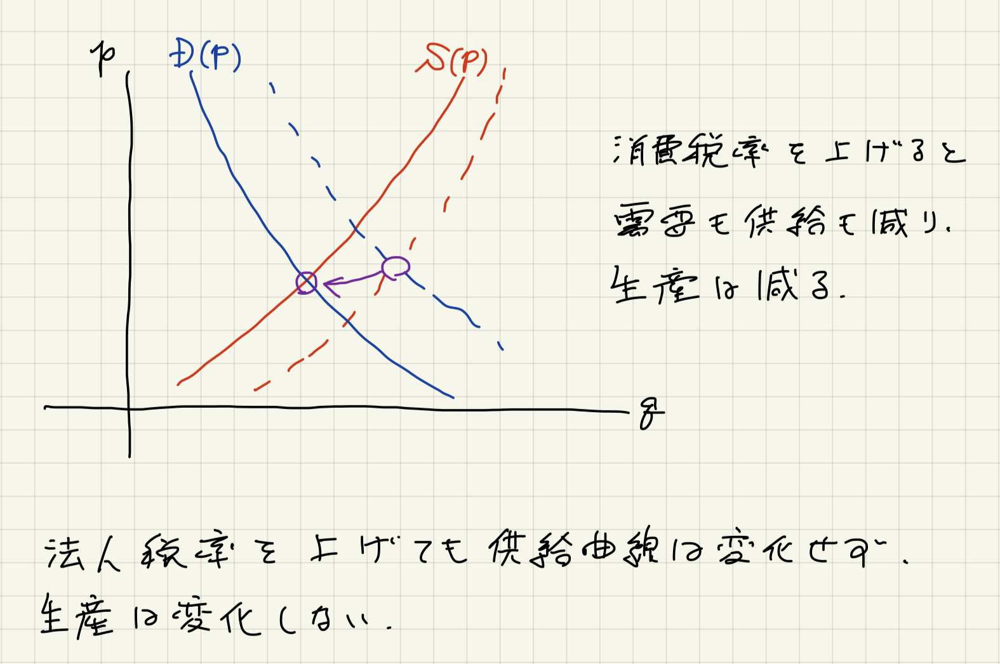
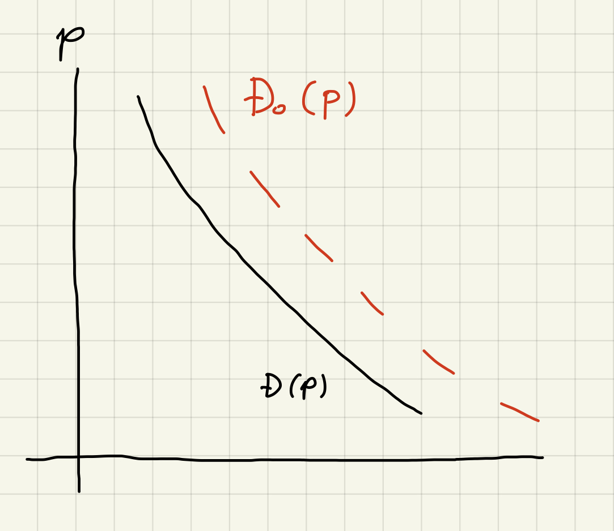
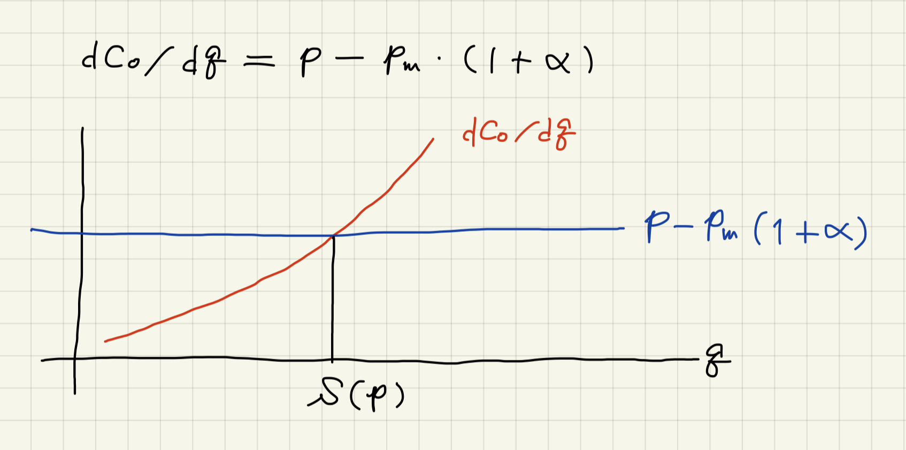

2023年
=========

コロナ経口抗ウイルス薬（2023-01-19）
-------------------------------------------------

コロナに感染した神奈川県の黒岩知事にも `処方されたパキロビッド <https://twitter.com/kuroiwayuji/status/1601174471867793413>`_ 。
効果は高いが、2022年8月の時点では処方の手続が煩雑なこともあり、一般にはあまり処方されていなかったらしい
（`「なぜ処方されにくい？　新型コロナの軽症者向け経口抗ウイルス薬」 <https://news.yahoo.co.jp/byline/kuraharayu/20220809-00309379>`_ ； `「COVID-19経口薬、処方のハードル高すぎ問題 」 <https://medical.nikkeibp.co.jp/leaf/mem/pub/blog/kurahara/202208/576180.html>`_）。
もし処方がされづらい状況が続いているならすぐに改善して欲しい。
この問題が現在どうなっているか、どうしたら確認できるのだろうか。

消費税と法人税（2023-01-06）
---------------------------------------

消費税と法人税の効果について簡単な考察をしてみた。
現実はこれほど単純ではないだろうが、少なくとも、消費税増税の悪影響を法人税減税で打ち消すことはできない可能性を示唆できていると考える。

結論
^^^^^^^^^^^^^^^^

簡単なモデルを通して考察したところ、法人税率を上げても下げても供給曲線は動かず均衡での生産量は変わらないものの、消費税率を上げると供給曲線も需要曲線も左にシフトし均衡での生産量は減ることが示された。

2014年4月の消費税増税時に法人税率が引き下げられたにも関わらず景気は大きく落ち込んだが
（2014年の経済状況については
`日本経済はなぜ浮上しないのか <https://www.amazon.co.jp/日本経済はなぜ浮上しないのか-アベノミクス第2ステージへの論点-片岡-剛士/dp/4344026756/>`_
に詳しい）,
これはモデルが示すことと整合的である。モデルを複雑にしても結論は変わらないように思われる。
ここでは政府支出については考慮していないが、現実には2014年に経済対策を打ったものの、経済成長率の大きな下振れを止めることはできなかったようである。
法人税率を下げれば企業の負担は減るが、消費税を増税するとそれを相殺して余りあるほどに売り上げが減って結局は利益を減らすことになりかねないのではなかろうか。

`財政の仕組みがわかる本 <https://www.amazon.co.jp/財政のしくみがわかる本-岩波ジュニア新書-神野-直彦/dp/4005005667/>`_ によると、日本では分離課税によって給与所得と資産所得に対する課税が分離されていて、資産所得は累進的にはなっていないとのことである。そのため日本でいちばん負担が重いのは（この本が書かれた当時だとは思うが）所得が2000万円から2500万円の層で、資本所得の多い高額所得者の税率は中間所得者と同じになっているらしい。
財源の問題が立ち上がるたびに消費税が俎上に載せられるが、なぜ資本所得の税率は話題に上がらないのだろうか。

モデル
^^^^^^^^^^^^^^^^^^^

消費税率と法人税率をそれぞれ
:math:`\alpha`,
:math:`\beta`
とする。
消費税がない時の価格 :math:`p` に対する需要関数を
:math:`D_0(p)`
とすると、需要関数は :math:`D(p)` は

.. math::

    D(p) = D_0((1 + \alpha)p)

と書ける。価格が上がると需要は減るだろうから
:math:`d D_0 /d p < 0`
を要請するのは妥当であり、従って
:math:`d D/ d p < 0`
となる。
当然の帰結として消費税率 :math:`\alpha` を増やすほど需要 :math:`D(p)` は減少する。

企業は財を :math:`q` だけ販売するとき

.. math::

    F(q) = (p q - C(q) ) (1 - \beta)

の利益を得る。
ここでコスト関数 :math:`C(q)` は財一単位あたりの原材料価格を :math:`p_\mathrm{m}` とするとき次のように分解できるものとする：

.. math::

    C(q) = C_0 (q) + p_\mathrm{m} ( 1 + \alpha)q.

ここで、自然な仮定として次を要請する：

.. math::

    \dfrac{d C_0}{d q} > 0,

    \dfrac{d^2 C_0}{d q} > 0.

企業は与えられた価格 :math:`p` のもとで :math:`F(q)` を最大化するので、供給 :math:`S(p)` は

.. math::

    S(p) = \underset{q}{\operatorname{arg\,max}}\, F(q)

によって決まる。上記の :math:`C_0` に対する要請により :math:`F(q)` は :math:`dF/dq = 0` となる :math:`q` で最大となる。よって

.. math::

    \dfrac{dF}{dq} = (1 - \beta) \left[ p - \dfrac{dC_0}{dq} - p_\mathrm{m} (1 + \alpha)\right] = 0

より

.. math::

    \dfrac{dC_0}{dq} = p - p_\mathrm{m} (1 + \alpha)

となる。供給関数 :math:`S(p)` が法人税率の影響を受けない一方で消費税率を増加させたときに減少することは次の図より明らか。

